# Set up a multi-tier Tier App using Nomad and Consul

## Why this tutorial?

Although there are many tutorials in the internet, a tutorial explaining a realistic multi-tier application working on Nomad and Consul is very rare. It took us a while to learn all the various pieces of the Nomad/Consul ecosystem and hope this tutorial helps the community to jump start their journey on the same.

We will be using the classic [spring-petclinic app](https://github.com/spring-petclinic) to demo the setup using Nomad and Consul.

This tutorial is made of following parts. 

[Part 1](#part-1) will include the following:
1. Setup an Nginx server running on Nomad to serve html, js, images etc built using AngularJs. The Nginc server will have envoy as a sidecar for service mesh.
2. Setup a springboot rest api running on Nomad. This workload will have envoy as a sidecar for service mesh and mTLS.
3. Setup a terminating gateway to route traffic outside the cluster
4. Setup an PostgreSQL DB outside the Nomad cluster which gets traffic from the cluster via the terminating gateway.
5. Setup an envoy ingress gateway to communicate with the web and rest services using mTLS and provide a way of internally load balancing the instances of web and rest services. 
6. Setup Fabio to load balance the ingress gateways for HA.
7. Consul intentions

[Part 2](#part-2) shows a CD pipeline to deploy the api and webapp using Jenkins and Jfrog into the nomad cluster. 

[Part 3](#part-3) is about Monitoring & Autoscaling using Prometheus & Grafana

[Part 4](#part-4) shows how to use Consul KV store for managing application configurations 

[Part 5](#part-5) shows setting up a HA rabbitmq cluster in nomad

## Pre-requisites

Setting up this on your local machine assumes the following pre-requisities:

- [Hashicorp Vagrant](https://www.vagrantup.com/docs/installation) installed on your local machine and available in your path
- [Oracle Virtualbox](https://www.virtualbox.org/wiki/Downloads) installed
- [git client](https://github.com/git-guides/install-git) installed
- [Docker](https://docs.docker.com/engine/install/) is running in your laptop. For mac, Docker Desktop would be ideal.

*Not tested in Windows but should work as it is or with some minor tweaks. If there are strange errors like illegal format or file not format, please try to run unix2dos to convert the scripts and files to dos format *

## Why Vagrant?

The idea behind this tutorial was to get something realistic working on your own desktop or laptop without needing to setup an environment in cloud. Vagrant provides a good way to create multiple nodes and play out the actual scenarios. That being said, this tutorial can easily be migrated to the cloud. Feel free to fork it or ping us to contribute on cloud specific tutorials.

## What this tutorial is not?

This is a tutorial created on top of a simple infrastructure using Vagrant (which is built primarily for dev use) and hence it is not secure for production use. Although we will be setting up mTLS for the service to service communication, there are many elements missing to make it completely secure. In the future, we will add certificates, Consul KV, Vault integration etc in the future release to show different aspects of securing the infrastructure as well. 
## Download the Repo first

	git clone https://github.com/nairnavin/practical-nomad-consul.git

## Change the directory to the Repo folder

	cd practical-nomad-consul
    vagrant up

## Quick check if everything works

Once the provisioning is over, you should be able to connect via http://localhost:4646 for Nomad UI and http://localhost:8500 for consul UI. Optionally, the nomad and consul UI should also be accessible from the cluster server IP - 172.16.1.101

To connect to the machine via ssh, use the vagrant ssh command:

    vagrant ssh server-dc1-1
    vagrant ssh client-dc1-2
    vagrant ssh client-dc1-3

For simplicity, the server and clients are in the same subnet.

<h2 id="part-1"><u>Part 1</u></h2>
#Run the multi-tier application using Nomad and Consul Connect

## Set up the PostgreSQL database in your local machine so that it simulates a DB outside the vagrant (nomad/consul) cluster
### 1. Run postgresql using docker
    docker run --name postgresdb -e POSTGRES_USER=postgres -e POSTGRES_PASSWORD=postgres -e POSTGRES_DB=petclinic -p 5432:5432 -d postgres
### 2. Initialize the database 

Use the table creation and data insert scripts external-services/init-db/initDB.sql and external-services/init-db/populateDB.sql, set up the tables and some test data. You can use pgadmin or psql for the task.

If you have postgresql client in your laptop, you can use the following commands:

    psql -h 127.0.0.1 -d petclinic -U postgres -f external-services/init-db/initDB.sql
    psql -h 127.0.0.1 -d petclinic -U postgres -f external-services/init-db/populateDB.sql

## Set up the Terminating Gateway
### 1. Register external postgres service in consul. 
    curl --request PUT --data @external-services/postgres.json 172.16.1.101:8500/v1/catalog/register

> Note: The 'Address' field in the postgres.json is configured with 10.0.2.2 which is the IP of the host machine mapped by vagrant from within the cluster. If there are issues connecting the rest api to the postgresql, one quick troubleshooting step would be to ssh into the vagrant server box and try connecting to the postgres at 10.0.2.2:5432. If it doesn't work, you may need to figure out the host ip on which the docker machine is running on your laptop.

### 2. Deploy terminating gateway job
    nomad job run jobs/cli-jobs/petclinic-egw.nomad

## Run the web and api services 
    nomad job run jobs/cli-jobs/petclinic-api.nomad
    nomad job run jobs/cli-jobs/petclinic-web.nomad


With this, your nomad cluster should be up and running with 2 instances of terminating gateway and 2 instances of web and api services. To confirm everything works, you can point your browser to http://172.16.1.101:4646 for the nomad jobs and http://172.16.1.101:8500 for consul services. 

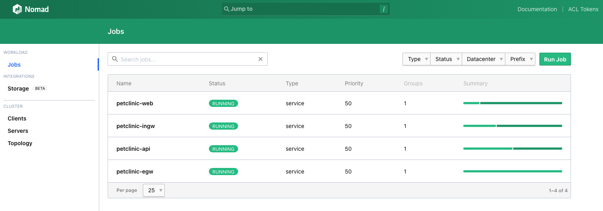

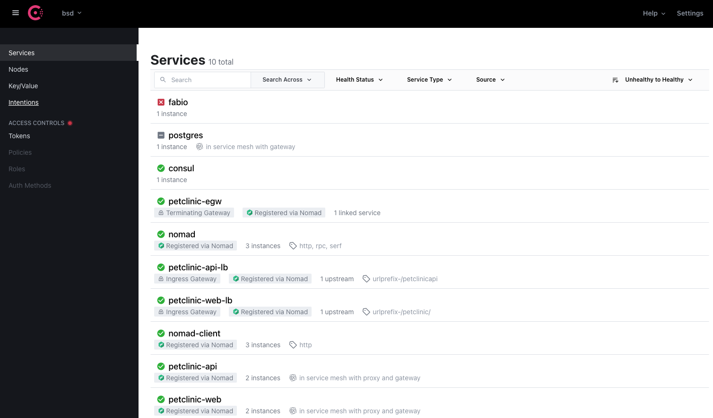

# Make the services accessible outside the cluster

## Run the ingress gateways
    nomad job run jobs/cli-jobs/petclinic-ingw.nomad

## Lets setup Fabio as a load balancer for the ingress gateways

    chmod +x launch-fabio-lb.sh
    ./launch-fabio-lb.sh

## Docker Compose

In addition to running these external services manually, these can also be run using below docker-compose command. Compose is a tool for defining and running multi-container Docker applications. With Compose, you use a YAML file to configure your application’s services. Then, with a single command, you create and start all the services from your configuration. 

`docker-compose up`

Docker compose runs below services with required configuration.

- Postgres Database
- Fabio Load balancer

## Time to check out the petclinic app running in Nomad cluster and using Consul connect for service mesh

The fabio load balancer will automatically go to consul and update itself with the URL for the ingress gateways. The ingress gateway provide an end point to the underlying api and web services running on worker nodes. 

The fabio registered services can be accessed via http://localhost:9998

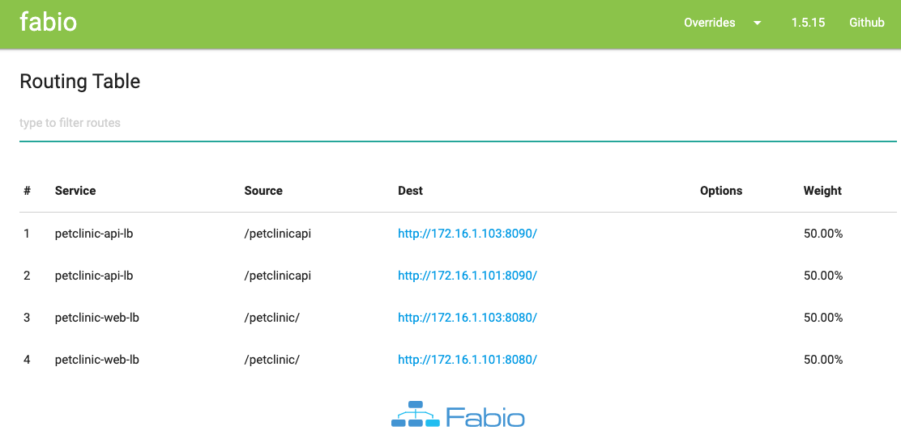

The petclinic app can be accessed via http://localhost:9999/petclinic/

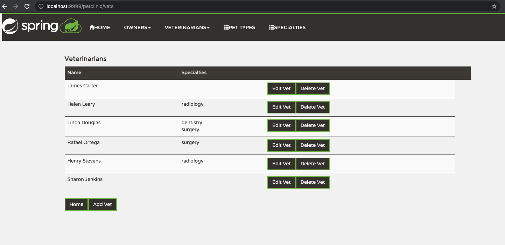

The petclinic api can be accessed via http://localhost:9999/petclinicapi/

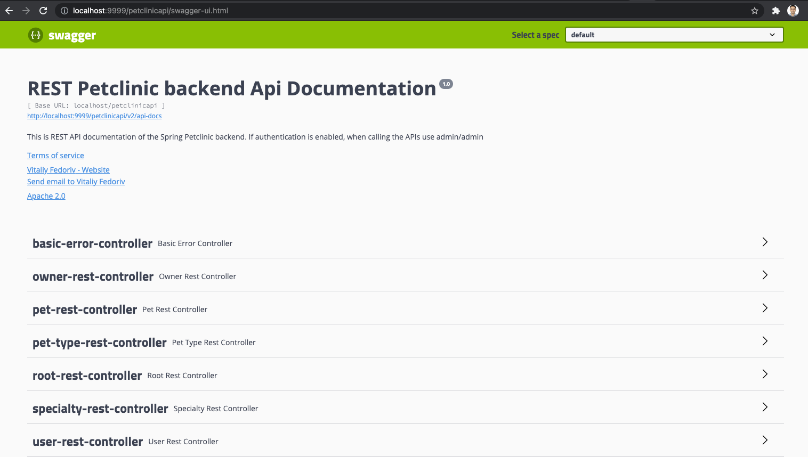

## Play around with consul intentions

Consul connect provides for a service to service authn/authz using a combination of mTLS and consul intentions. You can read about intentions in the consul documentation. If you want to play around with intentions, you can set up something like the image below to ensure only specific services talk to each other and the default is deny all

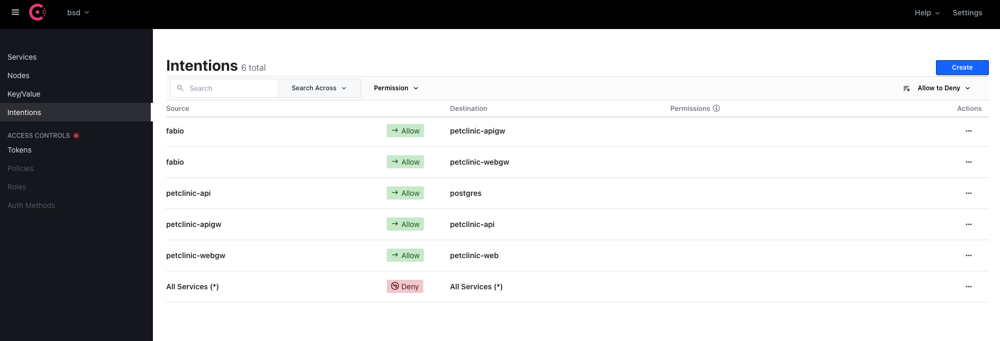


<h2 id="part-2"><u>Part 2</u></h2>
#  - CD Pipeline to deploy the API and WebApp

## Install Jenkins to setup a pipeline

    cd jenkins-docker
    docker build -t jenkins:local .
    docker run -p 8080:8080 -p 50000:50000 -v ~/jenkins_home:/var/jenkins_home jenkins:local

Once your run the above docker run command, Initial admin password will be generated and copy it. Post which you can access the jenkins url via http://localhost:8080/ and paste the initial admin password which is generated in terminal. Install all the suggested plugins and post which create your admin username and password
## Install JFROG to create a local binary Repo 


    docker run -d --name artifactory -p 9082:8082 -p 9081:8081 -v artifactory-data:/var/opt/jfrog/artifactory releases-docker.jfrog.io/jfrog/artifactory-oss:latest

- Access the JFROG url via http://127.0.0.1:9082/

- Login with default one--> **username**: admin  **password**: password (**Note:** You can change after you login) 

- Create the service username for Jenkins in JFROG repo under admin tab --> **username**: jenkins  **password**: Admin@123 

- Create the two local repository in JFROG  as shown in below name and repository type         `(**Spring-Petclinic-Angular-Local, Spring-Petclinic-Rest-Local**)

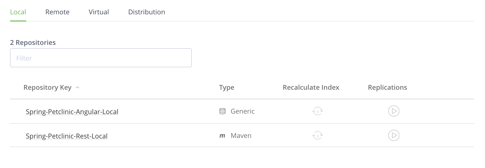

## Install and Configure Artifactory Plugin in Jenkins 

- Install Plugins: Go to Manage Jenkins --> Manage Plugins --> Search for "Artifactory" and Install it. 

- Configure Artifactory: Go to Manage Jenkins --> Configure Systems. You would find JFROG and Add JFROG Platform instance like below. 

Instance ID: **artifactory-server**
JFROG Platform URL : **http://host.docker.internal:9082**
Username: **jenkins**
password: **Admin@123**

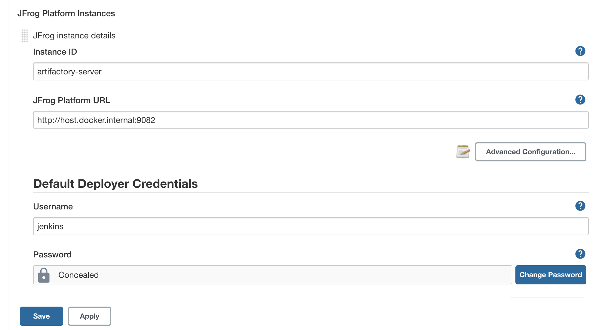


# Now Start Creating the pipeline and play around in Jenkins

### 1. Create the Spring Petclinic Restapi pipeline

- Under Jenkins Dashboard, Click on New item and name the pipeline as **spring-petclinic-restapi** and select the option as  pipeline script shown in below

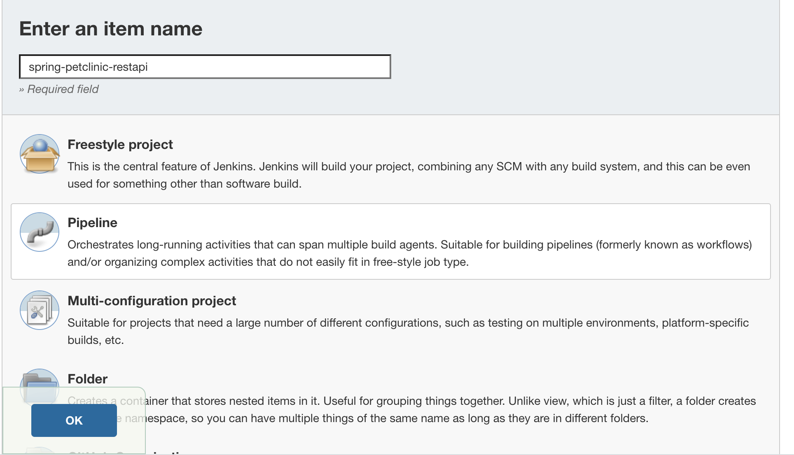

- Go to Pipeline Tab and select a option **Pipeline Script from SCM** under defintion and provide the restapi git url https://github.com/nairnavin/spring-petclinic-restapi.git as below screenshot


- Now save the pipeline and start triggering **Build Now Option**

### 2. Similarly create the pipeline for Spring Angular github and name the pipeline as _spring-petclinic-angular_ 
- https://github.com/nairnavin/spring-petclinic-angular.git

### 3. Create the Jenkins pipeline for _practical-nomad-consul_

- Git URL https://github.com/nairnavin/practical-nomad-consul.git

- Jenkins Job name should be **practical-nomad-consul** (This is very important CI pipeline will trigger this pipeline using Job Name) and configure **Pipeline Script from SCM** 

- Pipeline script path should be **pipeline-scripts/Jenkinsfile** as shown in below and branch should be **main**

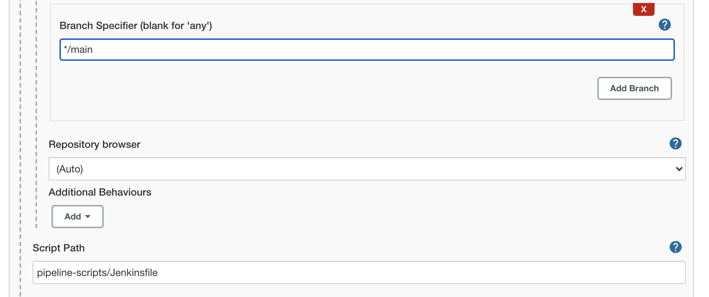

# Stop the Nomad Jobs which is created manually before triggering the pipeline 

    $ nomad stop -purge petclinic-web
    $ nomad stop -purge petclinic-api

# Trigger the Jenkins pipeline  

- Go into **spring-petclinic-restapi** Jenkins job and click Build Now.

- Restapi pipeline will automatically trigger the **_practical-nomad-consul_** job and post that go into the **_practical-nomad-consul_** job and approve the pipeline manually for Nomad Deployment.

- Follow the above steps for trigerring **_spring-petclinic-angular_** job


Access the petclinic Web  using http://localhost:9999/petclinic/

<h2 id="part-3"><u>Part 3</u></h2>
#Monitoring & Autoscaling

Assuming the VMs are already provisioned using the Vagrantfile in the root and Nomad/Consul is installed and configured as explained in the README in the root directory. Following jobs can also be deployed as explained in the README, which make sure the petclinic application is running and can be accessed via `http://localhost:9999/petclinic/`.

- petclinic-api
- petclinic-web
- petclinic-ingw
- petclinic-egw

## Monitoring

For monitoring purpose, we are going to use Prometheus and it can be installed as a Nomad job within the cluster.

```
nomad job run jobs/prometheus.nomad
```

This starts a prometheus server and this can accessed through the Fabio load balancer because of the `urlprefix` configuration in service tags.

```
      service {
        name = "prometheus"
        port = "prometheus_ui"
        tags = ["urlprefix-/"]
        ...
      }
```

Prometheus is available in `http://localhost:9999/`. In this exampe, we are going to have Grafana outside ther cluster. Grafana is configured as docker container using docker compose. Run the following command within `monitoring-autoscaling` folder to spin up the grafana.

```
docker-compose up -d
```

## Autoscaling

Nomad autoscaler plugin needs to be installed within the cluster as a Nomad job. Run the following command to provision the autoscaler,

```
nomad job run jobs/autoscaler.nomad
```

In this example, let's scale petclinic api based on CPU usage. Configure petclinic api nomad job with below scaling configuration.

```
    scaling {
      min     = 1
      max     = 4
      enabled = true

      policy {
        evaluation_interval = "2s"
        cooldown            = "5s"

        check "cpu_usage" {
          source = "prometheus"
          query  = "avg(nomad_client_allocs_cpu_total_percent{task='api'})"

          strategy "target-value" {
            target = 50
          }
        }
      }
    }
```

The load can be simulated using below command and you can observe that the instances are getting scale out.

```
hey -z 1m -c 5 http://localhost:9999/petclinicapi/api/owners
```

Detailed information of how monitoring and autoscaling works is available below.

# Monitoring

The Nomad agent collects various runtime metrics about the performance of different libraries and subsystems. These metrics are aggregated on a ten second interval and are retained for one minute.

This data can be accessed via an HTTP endpoint or via sending a signal to the Nomad process. This data is available via HTTP at `/metrics`. The metrics can be enabled in the agents using below configuration.

```
telemetry {
  collection_interval = "1s"
  disable_hostname = true
  prometheus_metrics = true
  publish_allocation_metrics = true
  publish_node_metrics = true
}
```

## Prometheus

Prometheus is used to scrape the metrics from the agents and store it in a time series database. Prometheus can be deployed into the cluster through a Nomad job. The job uses a Prometheus docker image. The job is located in [Prometheus Nomad Job](./monitoring-autoscaling/prometheus.nomad).

Prometheus has to be configured to scrap nomad metrics using the below configuration. Nomad agents expose an endpoint `/v1/metrics` for metrics scraping.

```
scrape_configs:

  - job_name: 'nomad_metrics'
    consul_sd_configs:
    - server: '172.16.1.101:8500'
      services: ['nomad-client', 'nomad']

    relabel_configs:
    - source_labels: ['__meta_consul_tags']
      regex: '(.*)http(.*)'
      action: keep

    scrape_interval: 5s
    metrics_path: /v1/metrics
    params:
      format: ['prometheus']
```

The Nomad client emits metrics related to the resource usage of the allocations and tasks running on it and the node itself. We will use one of the metrics to do the autoscaling, which we will discuss later.

### Spring boot metrics

In addition to Nomad metrics, Prometheus can be used to scrape metrics from Spring boot application. Metrics can be enabled in Spring boot using additional dependencies. More information to configure spring boot actuator metrics available [here](https://docs.spring.io/spring-boot/docs/current/reference/html/actuator.html#actuator.metrics).

Once spring boot metrics are configured, individual instances of petclinic-api service serve metric information throught his endpoint - `/petclinicapi/prometheus/actuator`. But this endpoint cannot be reached from prometheus, since API service is running within the consul service mesh. Only another service with the mesh can reach it through sidecar proxy, since the proxy does mTLS authentication.

To solve this problem, Nomad offers one more option called `expose` stanza within consul connect configuration.

https://www.nomadproject.io/docs/job-specification/expose#expose-examples

```
expose {
    path {
        path             =  "/petclinicapi/actuator/prometheus"
        protocol         =  "http"
        local_path_port  =  9966
        listener_port    =  "metrics"
    }
}
```

This configuration spins up one more sidecar proxy with a random port named listener on host and allows only `/petclinicapi/actuator/prometheus` endpoint. All other endpoints would return 404.

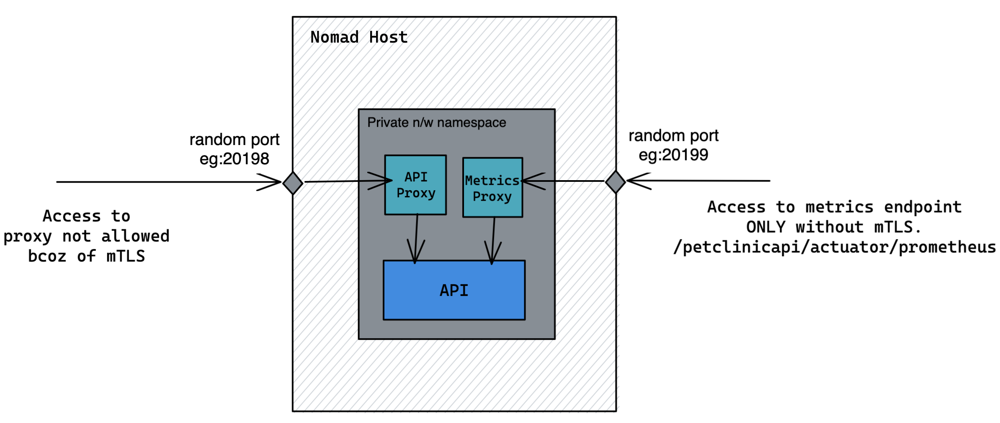

Now prometheus can be configured to scrape metrics from this endpoint. Since prometheus doesn't know the port of the metrics proxy, this has to be passed to prometheus somehow. This is where [Nomad environment variables](https://www.nomadproject.io/docs/runtime/interpolation#interpreted_env_vars) are really useful. The named ports are usually available in the environment variable `NOMAD_PORT_<label>`. In our case, it would be `NOMAD_PORT_metrics`. The instance might be running in any of the Nomad hosts, so IP is not constant. So we can use the variable `NOMAD_HOST_ADDR_metrics`, which has both IP and port. This value can be sent to Prometheus through service tag as below.

```
service {
      name = "api"
      tags = [ "addr:${NOMAD_HOST_ADDR_metrics}" ]
      port = "9966"
      ...
}
```

From prometheus configuration, this value can be extracted using the relabel configuration. The tag has been retrieved using the regex capture and replaced into '\__address\__' attribute.

```
  - job_name: 'actuator'
    metrics_path: /petclinicapi/actuator/prometheus
    consul_sd_configs:
    - server: '172.16.1.101:8500'
      services: ['api']
      
    relabel_configs:
    - source_labels: ['__meta_consul_tags']
      regex: ',addr:(.*),'
      target_label: '__address__'
      replacement: '$1'
      action: replace

    scrape_interval: 5s
    params:
      format: ['prometheus']
```

### Access Promethues

Prometheus can be accessed through Fabio load balancer. Fabio can be configured to run outside Nomad cluster using the docker compose file located [here](./docker-compose.yml). Fabio automatically pick up the services as backend, whichever has the tag `urlprefix-`. The confid looks like below.

```
service {
    name = "prometheus"
    port = "prometheus_ui"
    tags = ["urlprefix-/"]
    ...
}
```

Now the prometheus can be access through http://localhost:9999/. Verify the Status -> Targets menu in prometheus to check whether all metrics endpoints are up.

## Grafana

Once prometheus is configured to scrape metrics, Grafana can be used to create monitoring dashboards using the prometheus data. In this example, grafana is running outside the cluster and connect to prometheus server running inside the cluster. Grafana can be deployed using the docker compose file in this [location](./monitoring-autoscaling/docker-compose.yml).

Grafana has to be configured to talk to prometheus. The below configuration does that.

```
apiVersion: 1

datasources:
  - name: Prometheus
    type: prometheus
    access: direct
    url: http://localhost:9999
    jsonData:
      httpMethod: POST
```

The daahboard configuration for Grafana is also available in the format of JSON [here](./monitoring-autoscaling/grafana/dashboard.json). On accessing grafana at `http://localhost:3000/`, you will see something like below.

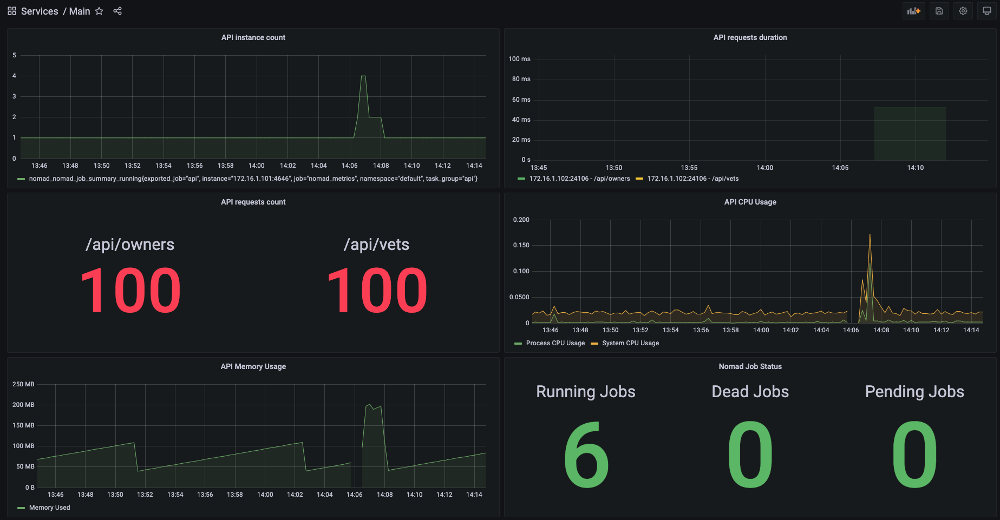

# Autoscaling

Nomad task instances can be scaled out to handle more traffic. Nomad uses a plugin called [nomad-autoscaler](https://github.com/hashicorp/nomad-autoscaler) to do this. The Nomad Autoscaler currently supports Horizontal application autoscaling, cluster autoscaling and dynamic application sizing. In the example, we focus on horizontal application autoscaling.

Nomad autoscaler need metrics data to take decisions on auto scaling. It can talk to Prometheus to get the data for auto scaling. Autoscaler has to be configured like below,

```
nomad {
  address = "http://172.16.1.101:4646"
}
telemetry {
  prometheus_metrics = true
  disable_hostname   = true
}
apm "prometheus" {
  driver = "prometheus"
  config = {
    address = "http://{{ range service "prometheus" }}{{ .Address }}:{{ .Port }}{{ end }}"
  }
}
strategy "target-value" {
  driver = "target-value"
}
```

The scaling requirements has to be configured in individual jobs. In this example, lets configure autoscaling for petclinic-api. Lets say we want to increase the instance count whenever there is an increase in CPU usage.

```
    scaling {
      min     = 1
      max     = 4
      enabled = true

      policy {
        evaluation_interval = "2s"
        cooldown            = "5s"

        check "cpu_usage" {
          source = "prometheus"
          query  = "avg(nomad_client_allocs_cpu_total_percent{task='api'})"

          strategy "target-value" {
            target = 50
          }
        }
      }
    }
```

Based on this configuration, the autoscaling will be triggered when the average CPU usage goes beyond 50%. The load can be simulated using the tool [hey](https://github.com/rakyll/hey). The below command uses 5 concurrent jobs and generates 200 requests per job for next 1 minute.

```
hey -z 1m -c 5 http://localhost:9999/petclinicapi/api/owners
```

After running this command, you can observe the instance count in either Nomad or Grafana dashboard. The autoscaling configuration demonstrated here is for sample purpose and it might differ in real time based on the requirement.

<h2 id="part-4"><u>Part 4</u></h2>
## Consul KV Store

### 1. Using Spring cloud & consul integration

Use this command to create key value in consul

    consul kv import @consul-kv-store/secrets/properties.json

Once key value is created in consul, restart your petclinic-api.nomad job.

Note: Please use consul-kv-store directory job file in case you want to fetch data from consul kv store.

Spring Boot Jar Changes:

Add spring-cloud-dependencies in the pom.xml

    <dependencyManagement>
        <dependencies>
            <dependency>
                <groupId>org.springframework.cloud</groupId>
                <artifactId>spring-cloud-dependencies</artifactId>
                <version>2020.0.0</version>
                <type>pom</type>
                <scope>import</scope>
            </dependency>
        </dependencies>
    </dependencyManagement>

Add spring-cloud-starter-consul-config dependency in the pom.xml

    <dependency>
        <groupId>org.springframework.cloud</groupId>
        <artifactId>spring-cloud-starter-consul-config</artifactId>
    </dependency>


Add the below configuration in application.properties file

    spring.application.name=consul_kv_demo
    spring.config.import=consul:localhost:8500
    spring.cloud.consul.discovery.health-check-interval=15s
    spring.cloud.consul.discovery.instance-id=random:8500

Add @EnableDiscoveryClient annotation in the main java file., PetClinicApplication.java

Add @RefreshScope annotation in the java file where @Value annotation is used so that on any key value change the
application refresh the value automatically.

### 2. Using Envconsul to fetch configuration from consul kv store

Use this command to create key value in consul

    consul kv import @envconsul-kv-store/secrets/properties.json

Once key value is created in consul, restart your petclinic-api.nomad job.

    nomad job run envconsul-kv-store/jobs/petclinic-api.nomad

For now, envconsul will fetch following configuration from kv store

    server.port: 9966
    server.servlet.context-path: /petclinicapi/
    greeting: "JackAndJoe123"

Note:
1. All the above configuration are present in properties.json file in base64 encrypted format.
2. In this method no changes are required in JAR, other than removing configuration properties from JAR.
3. This way of fetching key value from envconsul, will restart the spring application on any change in key value.
   We can use --once flag to disable this feature. This way envconsul will not listen any change in key value.


<h2 id="part-5"><u>Part 5</u></h2>
## Set up a HA RabbitMQ Cluster in Nomad

#Create RabbitMQ Cluster: 
    
    nomad job run rabbitmq/rabbitmq.nomad

This will run a 3 node rabbitmq cluster in host network mode with static port binding. 
The state (including queues and messages) will be persisted on a host volume (/var/lib/rabbitmq/data) mounted into the nomad tasks. 
The host volume `rabbit-data` is created from the nomad node configuration files -> `nomad-client-dc1.hcl` & `nomad-server-dc1.hcl`.

#Setup Terminating Gateway:

Register as external service in consul

    /* SSH into server-dc1-1 */
    > vagrant ssh server-dc1-1
    /* Go to the /vagrant directory. */
    > cd /vagrant
    /* register services with consul */
    > sh ./rabbitmq/register-rabbitmq-svc.sh 

deploy terminating gateway

    nomad job run rabbitmq/rabbitmq-egw.nomad

This is similar to how we accessed postgres (an external service) from pet-clinic-api (a service in our service mesh). 
Even though rabbitmq is running within our nomad cluster, we need to treat it as an external service and access it via terminating gateway.   
This is because rabbitmq is running in host mode and not part of the mesh. Running the rabbitmq cluster as part of the mesh is challenging since the rabbitmq peer discovery mechanism needs to discover other nodes of the cluster by hostname. 
This is not possible within the mesh as all communications goes through consul connect sidecar proxy.  

#Verify the cluster by going to the rabbitmq management UI:
    
    http://172.16.1.101:15672
    http://172.16.1.102:15672
    http://172.16.1.103:15672

#Deploy rabbitmq client job:

    nomad job run rabbitmq/rabbitmq-client.nomad

This will deploy a simple springboot application that provides an api to push messages into the rabbitmq cluster. Source code is available [here](https://github.com/ManikandanS86/springboot-rabbitmq)
Use the `GET /rabbitmq/produce?data=my-message-1` endpoint to push messages.

## Cleanup resources
### To stop the machines, use
    vagrant halt
    
### To destory all resources use

	vagrant destroy
 
## Credits

Like always, this tutorial stands on the shoulders for other brilliant people who have shared their knowledge with the world. Calling out few of the main tutorials and content that was referred to during the creation of this tutorial

- https://learn.hashicorp.com/nomad for tutorials and content on Hashicorp Nomad
- https://learn.hashicorp.com/consul for tutorials and content on Hashicorp Consul
- https://github.com/spring-petclinic for petclinic demo app
- https://github.com/discoposse/nomad-vagrant-lab for the vagrant lab setup

The authors may have referred & read many more articles and blogs during the research and we thank each one of them for sharing their learnings with us. Although there are too many to cite, we hope this tutorial is a way of honouring them and our contribution back to the community.
